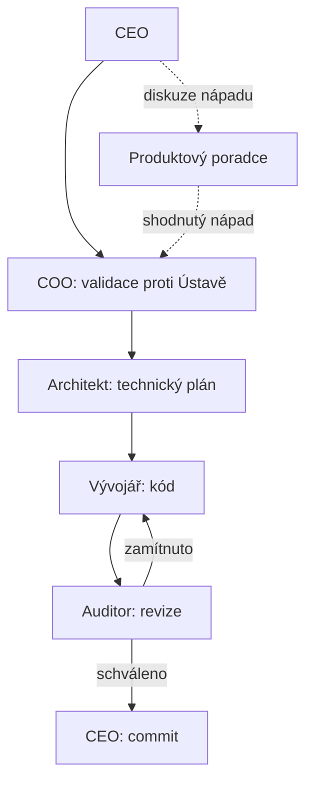

# README — Manuál AI továrny

Tento dokument je uvítací brána do systému `.cursor/`. Přečti si ho jako první, ať pochopíš, jak je celá "digitální továrna" poskládaná, jaké role v ní existují a jak je vyvolat.

## 1. Struktura složek

- **`.cursor/rules/`** — trvalé role továrny jako `.mdc` pravidla. Každý soubor je jedna role (COO, Architekt, Vývojář...). Podsložka `sop/` obsahuje technické standardy specifické pro tento projekt (tech stack, jazyk, testování) — tu si napiš sám, šablona ji záměrně neobsahuje.
- **`.cursor/skills/`** — jednorázové/opakovatelné procedury, které si libovolná role zavolá na konkrétní úkol (např. Komplexní audit). Není to osoba, je to proces.
- **`.cursor/vize/`** — vizionářské, chráněné dokumenty. Určují směr celé firmy, agenti je čtou, ale needitují bez explicitního svolení CEO.
- **`.cursor/notes/`** — poznámky, šablony k rozšiřování systému a historické záznamy (např. výstupy auditů).
- **`.cursor/plans/`** — plány generované agenty v Plan módu, než se schválí a spustí.

## 2. Filozofie

Celý systém se řídí [Ústava.md](vize/Ústava.md). Ve zkratce: dvě vrstvy řízení — **Vrstva 1 (Člověk)** určuje vizi, strategii a dělá rozhodnutí vyžadující lidský vkus nebo morální úsudek; **Vrstva 2 (Agenti)** exekuuje podle zadaných standardních operačních postupů (SOP) a nemá vlastní iniciativu mimo ně. Člověk už nepíše kód — pokud to dělá, systém podle Ústavy selhal.

## 3. Role a jak se volají

Role se vyvolávají napsáním `@nazev-souboru.mdc` do libovolného chatu. Nejde o proces běžící na pozadí — žádná role není "zapnutá" nebo "vypnutá", `.mdc` soubor je jen pravidlo, které se do daného chatu načte v okamžiku, kdy ho zmíníte. Nepotřebujete mít předtím otevřenou žádnou jinou roli.

| Role | Soubor | Vyvolání | Nadřízený | Hlavní úkol | Model / Effort |
| --- | --- | --- | --- | --- | --- |
| COO | `rules/coo.mdc` | `@coo.mdc` | CEO | Validuje zadání proti Ústavě a vizi, překládá je do briefu pro Architekta. | [MODEL_A], Thinking OFF, Medium |
| Architekt | `rules/architekt.mdc` | `@architekt.mdc` | CEO / COO | Navrhuje technické řešení a rozkrájí ho na atomické úkoly pro Vývojáře. | [MODEL_A], Thinking ON, Medium (High/Max při syntéze Komplexního auditu) |
| Vývojář | `rules/vyvojar.mdc` | `@vyvojar.mdc` | Architekt / CEO | Píše a upravuje kód přesně podle plánu Architekta. | [MODEL_B], Thinking OFF, Medium |
| Auditor | `rules/auditor.mdc` | `@auditor.mdc` | — | Kontroluje kód Vývojáře proti zadání Architekta před commitem. | [MODEL_C], Thinking OFF, Medium |
| Mentor | `rules/mentor.mdc` | `@mentor.mdc` | — | Vysvětluje CEO existující kód/plány lidskou řečí, nekóduje. | [MODEL_A], Thinking OFF, Low |
| Produktový poradce | `rules/produktovy-poradce.mdc` | `@produktovy-poradce.mdc` | COO | Proaktivně diskutuje s CEO nové nápady, po shodě je předá COO. | [MODEL_A], Thinking ON, Medium |
| Komplexní audit *(skill)* | `skills/komplexni-audit.mdc` | `@komplexni-audit.mdc` | — (speciální milníkový režim Auditora) | Spustí tři nezávislé subagenty (architektura, bezpečnost, konzistence) před releasem. | [MODEL_C] (koordinátor), Thinking OFF, Medium |

## 4. Standardní tok práce

## 5. Speciální větve

**Komplexní křížový audit** (milníkový, před releasem) je oddělený proces od běžné revize Auditora — spouští se přes `@komplexni-audit.mdc` ve `skills/`, který zadá tři nezávislé subagenty (architektura, bezpečnost, konzistence — konkrétní modely viz `ai-orchestrace.md` sekce 4), zřetězí jejich výstupy a předá je Architektovi k syntéze do opravného plánu. Detaily syntézy: `architekt.mdc`, větev "Speciální postup: Syntéza Komplexního křížového auditu".

## 6. Šablony k rozšiřování systému

- **[sablona-noveho-agenta.md](notes/sablona-noveho-agenta.md)** — použij, když potřebuješ novou trvalou roli (jednu osobu v továrně s vlastním zaměřením) → jde do `rules/`.
- **[sablona-nove-skill.md](notes/sablona-nove-skill.md)** — použij, když potřebuješ úkol/proceduru, která se dělí na nezávislé pilíře/pohledy řešené subagenty (jako Komplexní audit), ať paralelně nebo sekvenčně → jde do `skills/`.

## 7. Chráněné soubory

`ai-orchestrace.md`, `Ústava.md` a `vize_byznysu.md` (ve `vize/`) jsou vizionářské dokumenty — smí je měnit výhradně CEO, nebo agent s jeho explicitním svolením pro daný zásah. Agenti je čtou volně, needitují bez výslovného pokynu.

## 8. Údržba tohoto souboru

Za aktuálnost tohoto README odpovídá COO — při jakékoliv strukturální změně (nová role, přejmenování souboru, změna workflow, nová šablona) ho COO zaktualizuje jako součást té změny (viz `coo.mdc` sekce 4, bod 5).
