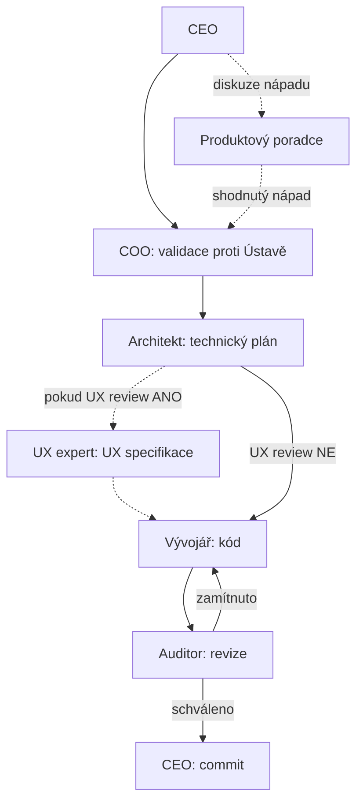

# README — Manuál AI továrny

Tento dokument je uvítací brána do systému `.cursor/`. Přečti si ho jako první, ať pochopíš, jak je celá "digitální továrna" poskládaná, jaké role v ní existují a jak je vyvolat. Je psaný tak, aby šel zkopírovat i do jiného projektu jako startovní bod pro podobnou továrnu — je o **struktuře továrny**, ne o produktu, který továrna staví.

## 1. Struktura složek

- **`.cursor/rules/`** — role továrny jako `.mdc` pravidla. Každý soubor je jedna role (COO, Architekt, Vývojář...). Podsložka `sop/` obsahuje technické standardy specifické pro tento projekt (tech stack, jazyk, testování).
- **`.cursor/vize/`** — vizionářské, chráněné dokumenty. Určují směr systému (proč existujeme i jak se orchestrují modely). Agenti je čtou, ale needitují bez explicitního svolení CEO.
- **`.cursor/.notes/`** — poznámky, šablony k rozšiřování systému a historické záznamy (např. výstupy auditů). Živý deník běžící smyčky je `prubeh-ukolu.md`.
- **`.cursor/plans/`** — plány generované agenty v Plan módu, než se schválí a spustí.

## 2. Filozofie

Celý systém se řídí [Ústava.md](vize/Ústava.md) (jak se pracuje). Ve zkratce: dvě vrstvy řízení — **Vrstva 1 (Člověk)** určuje vizi, strategii a dělá rozhodnutí vyžadující lidský vkus nebo morální úsudek; **Vrstva 2 (Agenti)** exekuuje podle zadaných standardních operačních postupů (SOP) a nemá vlastní iniciativu mimo ně. Člověk už nepíše kód — pokud to dělá, systém podle Ústavy selhal.

## 3. Role a jak se volají

Role se vyvolávají napsáním `@nazev-souboru.mdc` do libovolného chatu. Nejde o proces běžící na pozadí — žádná role není "zapnutá" nebo "vypnutá", `.mdc` soubor je jen pravidlo, které se do daného chatu načte v okamžiku, kdy ho zmíníte. Nepotřebujete mít předtím otevřenou žádnou jinou roli.

| Role               | Soubor                         | Vyvolání                  | Nadřízený                              | Hlavní úkol                                                                           | Model / Effort                                                                 |
| ------------------ | ------------------------------ | ------------------------- | -------------------------------------- | ------------------------------------------------------------------------------------- | ------------------------------------------------------------------------------ |
| COO                | `rules/coo.mdc`                | `@coo.mdc`                | CEO                                    | Validuje zadání proti Ústavě a vizi, překládá je do briefu pro Architekta.            | Claude Sonnet 5, Thinking OFF, Medium                                          |
| Architekt          | `rules/architekt.mdc`          | `@architekt.mdc`          | CEO / COO                              | Navrhuje technické řešení a rozkrájí ho na atomické úkoly pro Vývojáře.               | Claude Sonnet 5, Thinking ON, Medium (High/Max při syntéze Komplexního auditu) |
| UX expert          | `agents/ux-expert.md`          | Task (v Kroku 1b smyčky) / `@coo.mdc` pro samostatný audit | COO / Architekt | Dodá konkrétní UX specifikaci (rozložení, stavy, interakce, přístupnost) k plánu Architekta, nebo provede samostatný UX audit appky. | Claude Sonnet 5, Thinking ON, Medium |
| Vývojář            | `rules/vyvojar.mdc`            | `@vyvojar.mdc`            | Architekt / CEO                        | Píše a upravuje kód přesně podle plánu Architekta.                                    | Cursor Grok 4.6, Thinking OFF, Medium                                          |
| Auditor            | `rules/auditor.mdc`            | `@auditor.mdc`            | —                                      | Kontroluje kód Vývojáře proti zadání Architekta před commitem.                        | Claude Fable 5, Thinking OFF, Medium                                           |
| Mentor             | `rules/mentor.mdc`             | `@mentor.mdc`             | —                                      | Vysvětluje CEO existující kód/plány lidskou řečí, nekóduje.                           | Claude Sonnet 5, Thinking OFF, Low                                             |
| Produktový poradce | `rules/produktovy-poradce.mdc` | `@produktovy-poradce.mdc` | COO                                    | Proaktivně diskutuje s CEO nové nápady, po shodě čeká na explicitní @coo.mdc od CEO.  | Claude Sonnet 5, Thinking ON, Medium                                           |
| Komplexní audit    | `rules/komplexni-audit.mdc`    | `@komplexni-audit.mdc`    | — (speciální milníkový režim Auditora) | Spustí tři nezávislé subagenty (architektura, bezpečnost, konzistence) před releasem. | Claude Fable 5 (koordinátor), Thinking OFF, Medium                             |
| Cleaner            | `rules/cleaner.mdc`            | `@cleaner.mdc`            | CEO                                     | Hledá kolize, duplicity a smetí v `.cursor/` (pravidla, poznámky, plány), nic sám nemaže bez schválení. | Claude Sonnet 5, Thinking OFF, Medium                                          |

## 4. Standardní tok práce

Když běží produkční smyčka, otevři **[prubeh-ukolu.md](.notes/prubeh-ukolu.md)** — do něj všichni subagenti (a COO za ty, co nesmějí psát) připisují pod sebe, co dělají a proč. Na konci úkolu je tam sekce Shrnutí. `aktivni-ukol.md` je jen zámek (volno / běží), ne deník.

## 5. Speciální větve

**Komplexní křížový audit** (milníkový, před releasem) je oddělený proces od běžné revize Auditora — spouští se přes `@komplexni-audit.mdc`, který zadá tři nezávislé subagenty (architektura/Opus 5, bezpečnost/GPT-5.6 Sol, konzistence/Gemini 3.7 Flash), zřetězí jejich výstupy a předá je Architektovi k syntéze do opravného plánu. Detaily modelů a efortu: [ai-orchestrace.md](vize/ai-orchestrace.md) sekce 4. Detaily syntézy: `architekt.mdc`, větev "Speciální postup: Syntéza Komplexního křížového auditu".

## 6. Šablony k rozšiřování systému

- **[sablona-noveho-agenta.md](.notes/sablona-noveho-agenta.md)** — použij, když potřebuješ novou roli (jednu osobu v továrně s vlastním zaměřením).
- **[sablona-komplexni-ukol.md](.notes/sablona-komplexni-ukol.md)** — použij, když potřebuješ úkol, který se dělí na nezávislé pilíře/pohledy řešené subagenty (jako Komplexní audit), ať paralelně nebo sekvenčně.

## 7. Chráněné soubory

`ai-orchestrace.md` a `Ústava.md` (ve `vize/`) jsou vizionářské dokumenty — smí je měnit výhradně CEO, nebo agent s jeho explicitním svolením pro daný zásah. Agenti je čtou volně, needitují bez výslovného pokynu.

## 8. Údržba tohoto souboru

Za aktuálnost tohoto README odpovídá COO — při jakékoliv strukturální změně (nová role, přejmenování souboru, změna workflow, nová šablona) ho COO zaktualizuje jako součást té změny (viz `coo.mdc` sekce 4, bod 5).
